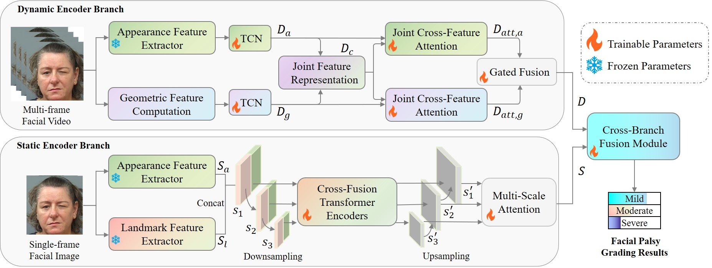

# MultiFPE

The official code for the paper _'MultiFPE: Multi-Representation Fusion Network for Facial Palsy Evaluation in Facial Videos'_.
MultiFPE is a novel multi-representation fusion framework for FPE, designed to effectively integrate complementary facial representations for reliable facial palsy evaluation.

**This paper has been accepted by IEEE Journal of Biomedical and Health Informatics.**

<p align="center">

</p>

## Project Structure

```text
MultiFPE/
├── annotation/                         # Train/test split files, named by dataset and fold
├── ckpt/                               # Pretrained weights
│   ├── ir50.pth
│   └── mobilefacenet_model_best.pth.tar
├── dataloader/                         # Video frame, static frame, landmark loading, and image augmentation
├── models/                             # MultiFPE model architecture
└── main_SCB_RJCMA.py                   # Training and validation entry point
```

## Data

Due to licensing restrictions, we cannot provide the complete AFLFP and MEEI datasets. Users need to obtain the raw datasets from their respective official project pages. The dataset annotations (facial landmarks and palsy severity grades) are publicly available. Users may only use the dataset annotations for non‑commercial academic research. Before downloading the dataset annotations, users are required to send an application email with the signed [End User License Agreement](End_User_License_Agreement.pdf) as an attachment to xiayifan@sdu.edu.cn using a valid academic or institutional email account.

## Environment Setup

Install the following dependencies:

```bash
pip install torch==2.0.1 torchvision==0.15.2 timm==0.6.13 numpy==1.26.4 matplotlib==3.7.2 scikit-learn==1.5.1 pillow==9.4.0
```

## Pretrained Weights

Before training, make sure the following files exist under `ckpt/`:

```text
ckpt/ir50.pth
ckpt/mobilefacenet_model_best.pth.tar
```

| File name | GoogleDrive link | BaiduNetdisk link |
| ---- | ---- | ---- |
| ir50.pth | [link](https://drive.google.com/drive/folders/1Wr9_TObGXqxGV5LPhmi2PE2ASCWlhIrQ) | [link](https://pan.baidu.com/s/1-T9dSCWuaKMJGfAfla1J0A?pwd=5vfx) |
| mobilefacenet_model_best.pth.tar | [link](https://drive.google.com/drive/folders/1Wr9_TObGXqxGV5LPhmi2PE2ASCWlhIrQ) | [link](https://pan.baidu.com/s/1-T9dSCWuaKMJGfAfla1J0A?pwd=5vfx) |

## Data Preparation

The training script reads the training and test sets from `annotation/<data_set>_train.txt` and `annotation/<data_set>_test.txt`. The current repository contains the following 5-fold splits:

```text
AFLFP_1 ~ AFLFP_5
MEEI_1  ~ MEEI_5
```

## Single-Fold Training and Validation

Run the training command from the project root directory.

Example: train and validate MEEI fold 5:

```bash
python main_SCB_RJCMA.py --data_set MEEI_5 --epochs 100 -b 16 -j 8 --lr 0.01
```

Example: train and validate AFLFP fold 1:

```bash
python main_SCB_RJCMA.py --data_set AFLFP_1 --epochs 100 -b 16 -j 8 --lr 0.01
```

During training, each epoch performs the following steps:

1. Train on `<data_set>_train.txt`.
2. Validate on `<data_set>_test.txt`.
3. Record Accuracy, F1-score, Precision, and Recall for both the training and validation sets.
4. Save the current checkpoint.
5. If the current validation accuracy is higher, save the best checkpoint and the best confusion matrix.

## 5-Fold Training

Windows PowerShell:

```powershell
foreach ($fold in 1..5) {
  python main_SCB_RJCMA.py --data_set "MEEI_$fold" --epochs 100 -b 16 -j 8 --lr 0.01
}
```

Linux/macOS:

```bash
for fold in 1 2 3 4 5; do
  python main_SCB_RJCMA.py --data_set MEEI_${fold} --epochs 100 -b 16 -j 8 --lr 0.01
done
```

Replace `MEEI` with `AFLFP` to train the 5 folds of the AFLFP dataset.

## Citation

If you find our work useful, please consider citing our paper:

```bibtex
@ARTICLE{11658594,
  author={Zhang, Yating and Jian, Muwei and Yu, Hui and Dong, Junyu and Xia, Yifan},
  journal={IEEE Journal of Biomedical and Health Informatics}, 
  title={MultiFPE: Multi-Representation Fusion Network for Facial Palsy Evaluation in Facial Videos}, 
  year={2026},
  volume={},
  number={},
  pages={1-14},  
  doi={10.1109/JBHI.2026.3724847}


